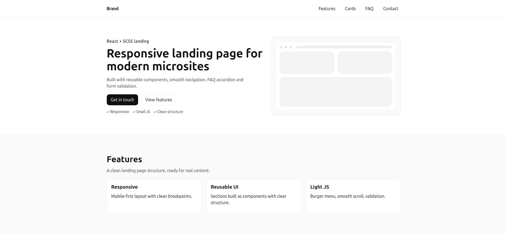

# React Landing Page (Vite + SCSS)
A single-page landing website built with **React + Vite**, using a modular component structure and **SCSS** for styling.  
The project represents a typical modern landing page with reusable UI sections, smooth anchor navigation, and responsive layout.

## Live Demo
- Production: https://react-landing-page-beta-mauve.vercel.app/

## Preview


## Features
- Responsive header (desktop & mobile) with burger menu
- Smooth anchor navigation with fixed-header offset
- Page sections:
    - Hero
    - Features (data-driven cards)
    - Cards (example cards / pricing blocks)
    - FAQ (accordion)
    - Contact form with basic client-side validation
- Clean SCSS architecture with variables, mixins, and global styles

## Tech Stack
- React
- Vite
- SCSS

## Project Structure
- src/components/layout – Header, Footer, Container
- src/components/sections – Hero, Features, Cards, FAQ, ContactForm
- src/components/ui – Button, SectionTitle
- src/styles – globals, variables, mixins
- src/utils – scroll helpers

## Getting Started
```bash
# install dependencies
npm install

# start development server
npm run dev

# build for production
npm run build

# preview production build
npm run preview
```